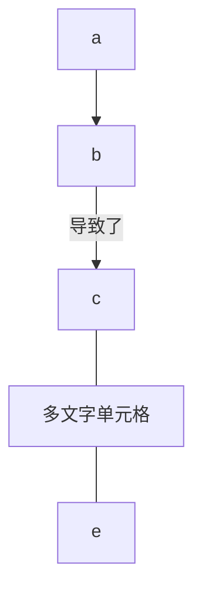
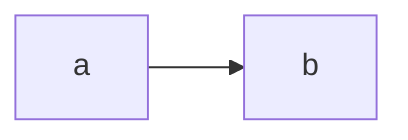

### footnote

Here's a simple footnote,[^1] and here's a longer one.[^bignote]

[^1]: This is the first footnote.

[^bignote]: Here's one with multiple paragraphs and code.

### list

##### <font color=Green> One </font>

First Term
: This is the definition of the first term.

Second Term
: This is one definition of the second term.
: This is another definition of the second term.

#### <font color=Blue> Two </font>

1. first
2. second
3. third

- first
- second
- third

### Code Highlight

```json
{
  "firstName": "John",
  "lastName": "Smith",
  "age": 25
}
```

### 原生锚点1

### form

##### default form

| Syntax      | Description |
| ----------- | ----------- |
| Header      | Title       |
| Paragraph   | Text        |

| Syntax | Description |
| --- | ----------- |
| Header | Title |
| Paragraph | Text |

##### center form

| Syntax      | Description | Test Text     |
| :---        |    :----:   |          ---: |
| Header      | Title       | Here's this   |
| Paragraph   | Text        | And more      |

### Emoji

去露营了！ :tent: 很快回来。

真好笑！ :joy:

### CheckBox

- [ ] Write the press release
- [ ] Update the website
- [ ] Contact the media

##### while above function can't work in .MD file, can use follow method to replace it

| Description                            | Checkmark               |
|----------------------------------------|-------------------------|
| HTML Entity: **check** mark            | &check;             |
| HTML Entity: heavy **check** mark      | ✔                      |
| HTML Entity: ballot box with **check** | ☑                      |
| HTML Entity: ballot box with x         | ☒                      |
| HTML Entity: ballot box (unchecked)    | ☐                      |
| Emoji: heavy **check** mark            | :heavy_check_mark:      |
| Emoji: ballot box **with** **check**   | :ballot_box_with_check: |
 | Emoji: white **check** mark | :white_check_mark: |

### Spacebreak

&emsp;`&emsp;` ⬅️ 空格代码

Addition {++ ++}
Deletion {-- --}
Substitution {~~ ~> ~~}
Comment {>> <<}
Highlight {== ==}{>> <<}

==marked==

<details>
 <summary>展开查看内容</summary>
 这是展开后的内容。
</details>

### 锚点链接

### 原生锚点2

[跳转到原生锚点1](#原生锚点1)
[跳转到原生锚点2](#原生锚点2)

### 层级引用

> 引用1
>> 引用2
>>> 引用3

### 数学公式

$$ 2^2 + 3^2 + Sigma _u^o $$

### 图表(Mermaid)

1. 纵向图表



2. 横向图表



### 标题链接

- [目录1](#40)
  - [标题1](#41)
  - [标题2](#42)
  - [标题3](#43)
  - [标题4](#44)

<h3 id="41">标题1</h3>
    轻轻的我走了， 正如我轻轻的来； 我轻轻的招手， 作别西天的云彩。
<h3 id="42">标题2</h3>
    正如我轻轻的来； 我轻轻的招手， 作别西天的云彩。
<h3 id="43">标题3</h3>
    我轻轻的招手， 作别西天的云彩。
<h3 id="44">标题4</h3>
    作别西天的云彩。
